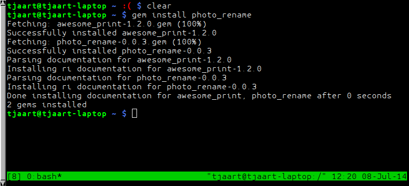

**DEPRECATION NOTICE!!!**

While struggling to get my environment stable after a long time away from Ruby, I decided to port the code into a language that I am more familiar with. Going forward the officially supported version of the app will be written in Nodejs, and is available [here](https://github.com/tjaartvdwalt/photo_rename_node)

# Photo Renamer #

[](http://badge.fury.io/rb/photo_rename)

## What the script does ##

This script is fairly specific. It renames all JPG files (technically files with a .jpg or .jpeg extenstion) in a given directory to the form `IMG_yyyymmdd_hhmmss.jpg`

## Rationale ##

The naming pattern described above is the naming pattern used by the stock Android camera. Renaming photos taken with other devices to this scheme allows me to seamlessly merge photos into a single directory and maintain consistent file names.

## Extracting the date ##

### exif meta data ###
Per default we now use the JPEG *exif meta data* to find the creation date of the file. This gives much more reliable results than using the *mtime* of the file.

Read [this](http://www.tjaart.co.za/software/2015/09/02/photo_rename/) blog entry if you are interested in why this was an important change for me.

### mtime ###

It is still possible to find the date with *mtime* using the `-f` command line switch, but using the *exif metadata* is the highly preferred method. 

~~After some experimenting I found that if I copy photos from my camera's memory card to my PC the "Modify Time" field gets preserved. Therefore I use this field as the basis for renaming the files. Obviously if you modify the file before renaming the mtime field will get updated and your file name will be wrong, so be warned!~~

~~**IMPORTANT NOTE**~~
~~Since I am renaming files based on the date created by the device that captured the image, this device's date should be correctly set. (For the next release I want to add more options to manually set the date)~~


## Installation ##

### Dependencies ###
Since version `0.1.0` we use exif metadata to get the file creation date by default. We use the ruby library `mini_exiftool` which has a dependency on [exiftool](http://www.sno.phy.queensu.ca/~phil/exiftool/).

`exiftool` should be easily installable through the package manager of most distributions.

**Arch Linux**

```bash
pacman -S perl-image-exiftool
```

**Ubuntu**

```bash
apt-get install libimage-exiftool-perl
```

**OSX**

http://www.sno.phy.queensu.ca/~phil/exiftool/ExifTool-10.00.dmg

**Windows**

http://www.sno.phy.queensu.ca/~phil/exiftool/exiftool-10.00.zip


### Ruby Gems ###

The easiest way to install the script is by using rubygems.

    gem install photo_rename



## Usage ##

    photo_rename photo_directory


## Change log ##

### 0.1.1 ###
-  Remove some debug output

### 0.1.0 ###

-   Use mini_exiftool to get the date from image metadata
-   Removed `-b` command line option, as this is not implemented yet

### 0.0.4 ###

-   Do not rename files that are already in the correct format.

### 0.0.1 - 0.0.3 ###

-   Sort out teething problems with gem.

### License ###

This program is licensed under [(<http://www.gnu.org/licenses/gpl-3.0.txt>)[GNU GPL]]
